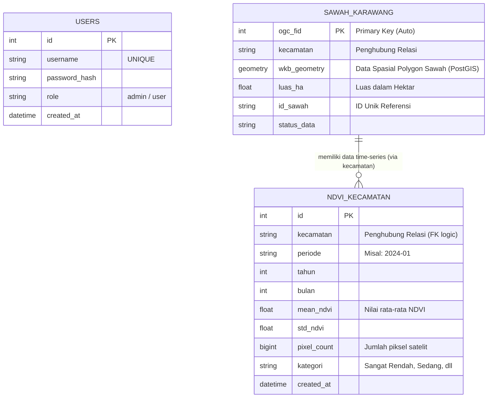

# 🌾 Karawang GIS Analytics Engine & PADDIX

Sistem Informasi Geografis (WebGIS) dan Dashboard Analitik Interaktif untuk pemantauan, inventarisasi, dan analisis lahan sawah di wilayah Kabupaten Karawang. Proyek ini dikembangkan untuk memfasilitasi monitoring kondisi vegetasi (NDVI) dan manajemen data spasial (poligon sawah) secara real-time.

---

## 🚀 Fitur Utama

### 1. 🗺️ Pemetaan Interaktif (WebGIS)
- **Satelit Basemap**: Visualisasi peta satelit resolusi tinggi yang terintegrasi.
- **Layer Poligon Sawah**: Menampilkan batas-batas petak lahan sawah berdasarkan data GeoJSON.
- **Klasifikasi Kerapatan Vegetasi (NDVI)**: Petak sawah diwarnai secara dinamis berdasarkan nilai indeks NDVI (Sangat Rendah, Rendah, Sedang, Tinggi) yang merepresentasikan fase tanam.
- **Inspeksi Visual Lahan**: Klik pada petak sawah mana saja untuk memunculkan popup informasi detail mengenai estimasi luas, nilai NDVI, dan status lahan.

### 2. 🛠️ Mode Digitasi (Manajemen Spasial)
Fitur eksklusif bagi administrator untuk melakukan modifikasi data spasial secara langsung melalui antarmuka web:
- **Gambar Poligon Baru**: Menggambar batas petak sawah baru secara langsung di atas peta satelit.
- **Edit Geometri (Auto-Save)**: Menggeser titik sudut (vertex) poligon yang sudah ada. Perubahan akan disimpan secara otomatis ke server (*real-time auto-save*).
- **Hapus Poligon**: Menghapus petak sawah yang sudah tidak relevan.
- *UI Premium*: Mode digitasi dilengkapi dengan *Floating Toolbar* bergaya *glassmorphism* yang elegan dan anti-tumpang tindih dengan mode *fullscreen*.

### 3. 📊 Dashboard Analitik & Insight
- **Executive Summary (Insight)**: Menyajikan narasi otomatis (Auto-Generated Insight) berdasarkan agregasi data spasial.
- **Indikator Kinerja Utama (KPI)**: Menampilkan Total Wilayah, Total Luas Sawah (Ha), dan Jumlah Petak secara responsif berdasarkan wilayah yang dipilih (Global vs Kecamatan).
- **Grafik Distribusi Luas (Bar Chart)**: Menampilkan peringkat kecamatan dengan lahan sawah terluas, tanpa *gap* data kosong, lengkap dengan fitur *scroll*.
- **Perbandingan Langsung Antar Wilayah**: Membandingkan tren fluktuasi NDVI antara dua kecamatan secara berdampingan.
- **Peringkat Regional (Top 5)**: Menampilkan daftar 5 besar kecamatan berdasarkan parameter tertentu (Terluas, Kepadatan, NDVI Tertinggi, NDVI Terendah).

### 4. 🗄️ Manajemen Data & Ekspor/Impor
- Sinkronisasi data ke backend melalui API.
- Kemampuan untuk *Download/Export* data analitik dan spasial (Excel/CSV).
- Fitur *Import* data untuk memperbarui basis data (jika didukung).

---

## 💻 Teknologi yang Digunakan

**Frontend (Client-Side):**
- **HTML5, CSS3, Vanilla JavaScript**: Dibangun tanpa *framework* berat untuk memastikan performa maksimal dan kustomisasi penuh.
- **Tema Desain**: *Dark Forest Green* dengan efek *Glassmorphism* (elegan, responsif, modern).
- **Leaflet.js**: Library pemetaan open-source utama.
- **Leaflet-Geoman**: Plugin untuk kapabilitas *drawing* dan *editing* geometri (Digitasi).
- **Chart.js**: Library untuk membangun grafik dan visualisasi data yang dinamis.

**Backend (Server-Side):**
- **Python (FastAPI)**: *Framework* web berkinerja sangat tinggi untuk membangun RESTful API. Melayani *routing* data dan *static files*.
- **Uvicorn**: Server ASGI yang menjalankan aplikasi FastAPI.
- **PostgreSQL & PostGIS**: Sistem manajemen basis data relasional yang digunakan untuk menyimpan data tabuler dan memproses data spasial geometri (`wkb_geometry`).

---

## 🗄️ Struktur Database & Relasi (ERD)

Aplikasi ini menggunakan tiga entitas tabel utama dalam PostgreSQL/PostGIS. Relasi utamanya bersifat *loosely coupled* menggunakan nama wilayah (`kecamatan`) sebagai penghubung antara data spasial dan data time-series analisis.



**Penjelasan Tabel:**
1. `sawah_karawang`: Menyimpan informasi spasial (Poligon) lahan sawah. Kolom `wkb_geometry` akan dimodifikasi ketika admin melakukan fungsi *Digitasi* di peta.
2. `ndvi_kecamatan`: Menyimpan data agregasi dan analisis indeks kerapatan vegetasi (NDVI) bulanan untuk setiap wilayah. Digunakan untuk merender grafik dan ranking.
3. `users`: Tabel autentikasi untuk membatasi akses fitur seperti Mode Digitasi hanya kepada pengguna dengan *role* admin.

---

## 📂 Struktur Direktori Proyek

```text
projek dashboard ta/
│
├── backend/                  # Folder sistem server-side
│   ├── main.py               # File utama FastAPI (Routing & API endpoints)
│   ├── data/                 # Penyimpanan database/GeoJSON lokal (jika ada)
│   └── ... 
│
├── frontend/                 # Folder sistem client-side (di-serve sebagai /static oleh Backend)
│   ├── index.html            # Halaman utama aplikasi WebGIS & Dashboard
│   ├── css/
│   │   └── style.css         # Styling utama (Tema, Layout, Glassmorphism, dll)
│   ├── js/
│   │   ├── app.js            # Entry point aplikasi, event listeners, dan inisialisasi UI
│   │   ├── map.js            # Konfigurasi Leaflet, manajemen layer, dan event pada peta
│   │   ├── admin.js          # Logika Mode Digitasi, manajemen CRUD poligon, dan toolbars
│   │   ├── charts.js         # Logika rendering grafik dengan Chart.js
│   │   └── data.js           # Fungsi komunikasi dengan API backend (Fetch Data)
│   └── assets/               # Gambar, ikon, dll
│
└── docs/                     # Dokumentasi tambahan
```

---

## ⚙️ Cara Menjalankan Aplikasi Lokal

1. **Pastikan Python terinstal** (Disarankan Python 3.9+).
2. Buka terminal/Command Prompt dan arahkan ke root direktori proyek (`D:\projek dashboard ta`).
3. (Opsional namun disarankan) Aktifkan *Virtual Environment*.
4. Masuk ke folder backend dan jalankan server menggunakan Uvicorn:
   ```bash
   cd backend
   uvicorn main:app --reload --port 5000
   ```
   *(Catatan: Port dapat berbeda, sesuaikan dengan konfigurasi sistem Anda, misalnya 3000 atau 8000)*
5. Buka Web Browser (Chrome/Edge/Firefox) dan akses URL:
   ```text
   http://127.0.0.1:5000/static/index.html
   ```

---

## 📝 Catatan Penting
- **Virtual Routing**: Walaupun secara fisik file UI berada di dalam folder `frontend/`, URL di browser tetap menggunakan lintasan `/static/`. Hal ini terjadi karena backend FastAPI dikonfigurasi untuk menjadikan folder `frontend` sebagai direktori statis utama.
- **Cache Browser**: Jika melakukan perubahan pada CSS atau JS namun tidak terlihat di layar, tekan **Ctrl + Shift + R** (Hard Refresh) untuk membersihkan *cache* browser.

---
*Dikembangkan untuk Tugas Akhir © Septa Repyandika 2026*
