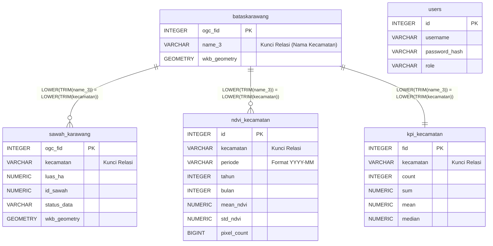

# Dokumentasi Teknis Sistem PADDIX
## Platform Analitik & WebGIS Lahan Sawah Kabupaten Karawang

> **Nama Sistem:** PADDIX — Paddy Field Analytical Dashboard & Information Explorer  
> **Versi API:** 2.0.0  
> **Stack Utama:** FastAPI · PostgreSQL/PostGIS · Leaflet.js · Chart.js  
> **Konteks:** Tugas Akhir Program D3 Sistem Informasi — Konsentrasi Business Intelligence

---

## Daftar Isi

1. [Topologi & Arsitektur Sistem (The Big Picture)](#1-topologi--arsitektur-sistem)
2. [Struktur Basis Data & Pipeline Data (ETL)](#2-struktur-basis-data--pipeline-data)
3. [Optimasi Kueri Analitik & Geospasial (Backend)](#3-optimasi-kueri-analitik--geospasial)
4. [Mekanisme Rendering & Visualisasi (Frontend)](#4-mekanisme-rendering--visualisasi)
5. [Referensi API Endpoint](#5-referensi-api-endpoint)

---

## 1. Topologi & Arsitektur Sistem

Sistem PADDIX dibangun menggunakan paradigma **3-Tier Architecture**, yang memisahkan tanggung jawab sistem ke dalam tiga lapisan independen agar mudah dipelihara dan dikembangkan.

```
┌─────────────────────────────────────────────────────────┐
│                    BROWSER PENGGUNA                      │
│  ┌─────────────┐  ┌──────────────┐  ┌───────────────┐  │
│  │  Leaflet.js  │  │  Chart.js    │  │  Vanilla JS   │  │
│  │  (Peta GIS)  │  │  (Grafik BI) │  │  (App Logic)  │  │
│  └──────┬───────┘  └──────┬───────┘  └───────┬───────┘  │
│         │                 │                   │          │
│         └─────────────────┴───────────────────┘          │
│                           │ HTTP / REST API              │
│                    TIER 1: CLIENT-SIDE                   │
└───────────────────────────┼─────────────────────────────┘
                            │ (Request / Response JSON)
┌───────────────────────────┼─────────────────────────────┐
│                    TIER 2: SERVER-SIDE                   │
│                           │                              │
│              ┌────────────▼────────────┐                 │
│              │   FastAPI (Python)       │                 │
│              │   Uvicorn ASGI Server   │                 │
│              │                         │                 │
│              │  ┌──────┐ ┌──────────┐ │                 │
│              │  │ ndvi │ │ geojson  │ │                 │
│              │  ├──────┤ ├──────────┤ │                 │
│              │  │ kpi  │ │ admin    │ │  ← Routers      │
│              │  ├──────┤ ├──────────┤ │                 │
│              │  │ auth │ │ (static) │ │                 │
│              │  └──────┘ └──────────┘ │                 │
│              └────────────┬────────────┘                 │
│                    TIER 2: SERVER-SIDE                   │
└───────────────────────────┼─────────────────────────────┘
                            │ (SQLAlchemy / psycopg)
┌───────────────────────────┼─────────────────────────────┐
│                    TIER 3: DATABASE                      │
│              ┌────────────▼────────────┐                 │
│              │  PostgreSQL 15+          │                 │
│              │  + Ekstensi PostGIS      │                 │
│              │                         │                 │
│              │  bataskarawang          │                 │
│              │  sawah_karawang         │                 │
│              │  ndvi_kecamatan         │                 │
│              │  kpi_kecamatan          │                 │
│              │  users                  │                 │
│              └─────────────────────────┘                 │
│                    TIER 3: DATABASE                      │
└─────────────────────────────────────────────────────────┘
```

### 1.1 Tier 1 — Client-Side (Frontend)

Berjalan sepenuhnya di dalam browser pengguna tanpa memerlukan instalasi apapun. Terdiri dari:

| Teknologi | Peran |
|---|---|
| **HTML5** | Struktur halaman, semantic markup, dan konten statis |
| **CSS3 (Vanilla)** | Desain visual: dark theme, glassmorphism, animasi micro-interaction |
| **JavaScript (ES6+)** | Logika aplikasi, manajemen state, dan komunikasi API |
| **Leaflet.js v1.9.4** | Engine rendering peta interaktif berbasis tile dan GeoJSON |
| **Leaflet-Geoman v2.19** | Plugin tambahan untuk kapabilitas menggambar dan mengedit geometri poligon (Mode Digitasi) |
| **Chart.js** | Library untuk visualisasi data grafik garis (Time Series), batang horizontal, dan grafik komparasi |

**Virtual Routing:** Meskipun file frontend secara fisik tersimpan di folder `frontend/`, server FastAPI memetakan folder tersebut ke URL path `/static/` melalui mekanisme `StaticFiles`. Sehingga browser mengakses antarmuka melalui `http://localhost:8000/static/index.html`.

```python
# main.py — Virtual routing mapping
app.mount("/static", StaticFiles(directory=frontend_dir), name="static")
```

### 1.2 Tier 2 — Server-Side (Backend)

Dibangun menggunakan **FastAPI** (Python) yang dijalankan oleh server **Uvicorn** (ASGI). Backend berperan sebagai:
- Memproses logika bisnis dan kalkulasi agregasi data
- Mengeksekusi kueri SQL kompleks ke database
- Menyajikan data dalam format **JSON** dan **GeoJSON** ke frontend
- Mengamankan akses administrator melalui sistem autentikasi **JWT (JSON Web Token)**

Backend diorganisasi ke dalam 5 modul Router yang masing-masing menangani domain berbeda:

```
backend/
├── main.py          ← Entry point, inisialisasi, CORS, mount static
├── database.py      ← Konfigurasi koneksi PostgreSQL (SQLAlchemy)
├── models.py        ← Definisi tabel ORM (NdviKecamatan, User)
├── schemas.py       ← Validasi format request/response (Pydantic)
├── auth_utils.py    ← Logika bcrypt hash, JWT encode/decode
└── routers/
    ├── geojson.py   ← Endpoint peta (GeoJSON batas & poligon sawah)
    ├── ndvi.py      ← Endpoint data NDVI (tren, summary, komparasi)
    ├── kpi.py       ← Endpoint KPI (statistik lahan per kecamatan)
    ├── admin.py     ← Endpoint CRUD poligon, import/export data
    └── auth.py      ← Endpoint login, token refresh
```

### 1.3 Tier 3 — Database Tier

Menggunakan **PostgreSQL** versi 15+ yang dipersenjatai dengan ekstensi **PostGIS**. PostGIS adalah add-on krusial yang memberikan kemampuan database untuk memahami, menyimpan, dan memproses data koordinat geografis (titik, garis, poligon).

**String Koneksi:**
```python
# database.py
DATABASE_URL = f"postgresql+psycopg://{DB_USER}:{DB_PASSWORD}@{DB_HOST}:{DB_PORT}/{DB_NAME}"
# Nama database: " bi_gis_karawang" (perhatikan spasi di depan — quirk konfigurasi lokal)
```

---

## 2. Struktur Basis Data & Pipeline Data (ETL)

### 2.1 Arsitektur Tabel

Sistem menggunakan **5 tabel** dengan fungsi yang berbeda-beda:

#### `bataskarawang` — Tabel Master Batas Wilayah
Tabel ini berisi poligon batas administratif tingkat kecamatan se-Kabupaten Karawang. Data diimpor dari sumber GIS eksternal (QGIS/GDAL) dan **tidak boleh dimodifikasi oleh pengguna** karena merupakan data acuan georeferensi.

```sql
-- Kolom kunci:
name_3        VARCHAR   -- Nama kecamatan (kunci relasi logis)
wkb_geometry  GEOMETRY  -- Poligon batas wilayah (MultiPolygon, SRID 4326)
```

#### `sawah_karawang` — Tabel Objek Lahan Sawah
Tabel utama yang menyimpan setiap petak sawah sebagai satu baris data. Geometri poligon tiap petak sawah tersimpan di kolom `wkb_geometry` dalam format **WKB (Well-Known Binary)** yang merupakan format standar PostGIS. Isi tabel ini dapat dimodifikasi oleh administrator melalui fitur Mode Digitasi.

```sql
-- Struktur tabel:
ogc_fid       SERIAL PRIMARY KEY   -- ID unik auto-increment (dibuat oleh OGR2OGR)
kecamatan     VARCHAR(100)         -- Nama kecamatan (kunci relasi logis)
wkb_geometry  GEOMETRY(MultiPolygonZ, 4326)  -- Geometri 3D (Z-coord) petak sawah
luas_ha       NUMERIC              -- Luas petak dalam Hektar (dihitung otomatis oleh PostGIS)
id_sawah      NUMERIC              -- ID referensi dari sumber data original
status_data   VARCHAR              -- Status validasi ('valid', 'draft', dll.)
```

> **Catatan Teknis:** Saat admin menyimpan poligon baru atau mengedit geometri, backend secara otomatis menghitung ulang luas menggunakan `ST_Area(...::geography) / 10000.0`. Fungsi `::geography` digunakan agar kalkulasi luas dilakukan dalam satuan meter persegi berdasarkan kelengkungan bumi (bukan proyeksi datar), sehingga hasil luas dalam Hektar menjadi akurat secara geodetis.

#### `ndvi_kecamatan` — Tabel Metrik NDVI Historis (Time-Series)
Merupakan jantung dari sistem Business Intelligence ini. Setiap baris merepresentasikan **nilai rata-rata NDVI untuk satu kecamatan pada satu periode bulanan tertentu**. Data ini yang digunakan untuk merender grafik tren fenologi padi.

```sql
-- Struktur tabel:
id            SERIAL PRIMARY KEY
kecamatan     VARCHAR(100)       -- Nama kecamatan (kunci relasi logis)
periode       VARCHAR(7)         -- Format 'YYYY-MM' (contoh: '2024-03')
tahun         INTEGER
bulan         INTEGER
mean_ndvi     NUMERIC(10, 6)     -- Nilai rata-rata NDVI (range: -1.0 s/d 1.0)
std_ndvi      NUMERIC(10, 6)     -- Standar deviasi NDVI (ukuran homogenitas vegetasi)
pixel_count   BIGINT             -- Jumlah piksel satelit valid yang dikalkulasi
jumlah_citra  INTEGER            -- Jumlah scene satelit yang dikomposit pada periode ini
kategori      VARCHAR(50)        -- Label fase: 'Rendah', 'Sedang', 'Tinggi', dll.
created_at    DATETIME
```

> **Constraint Unik:** Tabel ini memiliki constraint `UNIQUE(kecamatan, periode)` yang memungkinkan operasi **UPSERT** saat import CSV — data yang sudah ada akan diperbarui, bukan diduplikasi.

#### `kpi_kecamatan` — Tabel KPI Statistik Lahan (Pre-computed)
Tabel ini menyimpan statistik deskriptif lahan sawah per kecamatan yang **sudah dikalkulasi sebelumnya** (_pre-computed_). Tujuannya adalah untuk mempercepat loading dashboard — data KPI (jumlah petak, total luas, rata-rata, median, dll.) dapat diambil seketika tanpa perlu melakukan `GROUP BY` yang berat ke `sawah_karawang` setiap saat.

```sql
-- Kolom-kolom statistik yang tersedia:
kecamatan   VARCHAR         -- Identitas kecamatan
"count"     INTEGER         -- Jumlah total petak sawah
"sum"       NUMERIC         -- Total luas sawah (Ha)
"mean"      NUMERIC         -- Rata-rata luas per petak (Ha)
"median"    NUMERIC         -- Median luas (nilai tengah)
"stddev"    NUMERIC         -- Standar deviasi luas
"min"       NUMERIC         -- Petak sawah terkecil (Ha)
"max"       NUMERIC         -- Petak sawah terbesar (Ha)
q1, q3, iqr NUMERIC         -- Statistik kuartil untuk analisis sebaran
```

Setiap kali administrator menambah, mengedit, atau menghapus poligon sawah melalui Mode Digitasi, backend secara otomatis memanggil fungsi `_refresh_kpi()` untuk memperbarui baris terkait di tabel ini.

#### `users` — Tabel Keamanan & Autentikasi
```sql
id            SERIAL PRIMARY KEY
username      VARCHAR(50) UNIQUE NOT NULL
password_hash VARCHAR(255) NOT NULL    -- bcrypt hash, bukan plain-text
role          VARCHAR(20) DEFAULT 'user'  -- 'admin' atau 'user'
created_at    DATETIME
```

---

### 2.2 Entity Relationship Diagram (ERD) & Relasi Logis

> ⚠️ **Catatan Arsitektur Krusial**
> Relasi antar-tabel dalam sistem ini **tidak menggunakan mekanisme Foreign Key (FK) bawaan database**. Ini adalah keputusan desain yang disengaja.

**Alasannya:** Tabel spasial seperti `bataskarawang` dan `sawah_karawang` diimpor langsung dari sumber GIS eksternal menggunakan tool `OGR2OGR` / QGIS. Proses import GIS tidak mengenal skema relasional PostgreSQL, sehingga nilai teks pada kolom `kecamatan` di berbagai tabel bisa memiliki variasi penulisan (spasi di awal/akhir, perbedaan kapital huruf).

**Solusinya:** Backend menggunakan fungsi `LOWER(TRIM(kecamatan))` sebagai **kunci JOIN teks yang aman** pada setiap kueri yang menghubungkan antar-tabel.

**Visualisasi Relasi (ERD Logis):**



```sql
-- Contoh JOIN aman antar tabel batas wilayah dan NDVI:
-- Dari geojson.py
LEFT JOIN (
    SELECT kecamatan, AVG(mean_ndvi) AS avg_ndvi, ...
    FROM ndvi_kecamatan
    GROUP BY kecamatan
) sub_n ON LOWER(b.name_3) = LOWER(sub_n.kecamatan)

-- Contoh filter pada tabel sawah:
-- Dari geojson.py
WHERE LOWER(TRIM(kecamatan)) = LOWER(TRIM(:nama_kecamatan))
```

---

### 2.3 Pipeline ETL (Extract, Transform, Load)

```text
[ SUMBER DATA PRIMER ]
       │
       ├─── 1. Pipeline Analisis Satelit (NDVI)
       │         │ (Data: Sentinel-2 / Landsat via Google Earth Engine)
       │         ▼
       │    Kalkulasi Raster NDVI per piksel → Agregasi per wilayah (Zonal Statistics)
       │         │ (Export CSV: kecamatan, periode, mean_ndvi, pixel_count, dll)
       │         ▼
       │    [Proses Transform & Load via Endpoint Admin]
       │    POST /api/admin/ndvi/import-csv
       │         │ - Validasi anomali: Nilai < -9999 atau > 1 diubah menjadi NULL
       │         │ - Validasi ketat (Strict): Jika ada format tidak sesuai, seluruh proses dibatalkan (Rollback)
       │         │ - Operasi UPSERT: ON CONFLICT (kecamatan, periode) DO UPDATE
       │         ▼
       │    [ DATABASE TIER ] → Tabel: ndvi_kecamatan
       │
       ├─── 2. Pipeline Geospasial (Sawah & Batas Wilayah)
       │         │ (Data: Hasil Digitasi QGIS / Field Survey GPS)
       │         ▼
       │    Export vektor ke format GeoJSON/Shapefile
       │         │ (Load via OGR2OGR / QGIS DB Manager)
       │         ▼
       │    [ DATABASE TIER ] → Tabel: sawah_karawang & bataskarawang
       │         │ (wkb_geometry disimpan sebagai MultiPolygonZ SRID 4326)
       │
       └─── 3. Pipeline Interaksi Pengguna (Pencarian Koordinat & Drill-Down)
                 │ (Aksi: User memasukkan koordinat lat,lng di browser)
                 ▼
            [ CLIENT-SIDE JAVASCRIPT ]
                 │ - Validasi format Desimal/DMS (Regex)
                 │ - Reverse Geocoding via Nominatim API (OpenStreetMap)
                 │ - Point-in-Polygon Ray-Casting Algorithm (Cek batas GeoJSON di memori browser)
                 ▼
            [ MAP RENDERING ]
                 │ - FlyTo titik koordinat
                 │ - Jika titik masuk di area Karawang -> Trigger Event Drill-Down
                 ▼
            GET /api/geo/sawah?kecamatan=X
                 │ - Server mengambil dan menyederhanakan geometri (ST_SimplifyPreserveTopology)
                 ▼
            [ RENDER AKHIR ] -> Visualisasi Poligon Sawah & Update Grafik Tren
```

---

### 2.4 Prosedur Autentikasi & Keamanan

**Enkripsi Kata Sandi (Password Hashing):**

Sistem tidak pernah menyimpan kata sandi dalam bentuk teks biasa. Setiap kata sandi diproses menggunakan algoritma **bcrypt** — sebuah fungsi hash kriptografis satu arah yang dirancang khusus untuk mengamankan kata sandi. bcrypt secara otomatis menghasilkan nilai *salt* yang unik setiap kali dieksekusi, sehingga dua kata sandi yang identik akan menghasilkan hash yang berbeda.

```python
# auth_utils.py
import bcrypt

def hash_password(password: str) -> str:
    # bcrypt.gensalt() membuat salt unik secara otomatis
    return bcrypt.hashpw(password.encode('utf-8'), bcrypt.gensalt()).decode('utf-8')

def verify_password(plain: str, hashed: str) -> bool:
    # Verifikasi dilakukan dengan membandingkan hash, bukan plain text
    return bcrypt.checkpw(plain.encode('utf-8'), hashed.encode('utf-8'))
```

Hasil hash disimpan di kolom `password_hash VARCHAR(255)`. Panjang 255 karakter dipilih karena output bcrypt selalu 60 karakter, namun diberi ruang ekstra untuk kompatibilitas ke depan.

**JSON Web Token (JWT):**

Setelah login berhasil, server menerbitkan **JWT** yang berlaku selama **168 jam (7 hari)**. Token ini menggunakan algoritma penandatanganan **HS256** dan dikirimkan oleh browser pada setiap request ke endpoint admin melalui header `Authorization: Bearer <token>`.

```python
# auth_utils.py
SECRET_KEY = "karawang-gis-dashboard-secret-key-2026-very-secure"
ALGORITHM  = "HS256"
ACCESS_TOKEN_EXPIRE_HOURS = 168  # 7 hari
```

**Proteksi Endpoint Admin (Role-Based Access Control):**

Setiap endpoint yang bersifat merusak (tambah/edit/hapus poligon, import data) dilindungi oleh dependency `require_admin`. FastAPI akan otomatis memvalidasi token dan memeriksa role pengguna sebelum fungsi endpoint dieksekusi.

```python
# Contoh deklarasi proteksi endpoint di admin.py
@router.post("/sawah")
def create_sawah(
    body: SawahCreate,
    admin: User = Depends(require_admin),  # ← Harus role 'admin'
    db:    Session = Depends(get_db)
):
    ...
```

---

## 3. Optimasi Kueri Analitik & Geospasial

Ini adalah "otak" dari sistem Business Intelligence — bagaimana data geospasial mentah yang berukuran besar dapat disajikan secara cepat dan efisien oleh backend.

### 3.1 Penyederhanaan Geometri (Geometry Simplification)

**Fungsi:** `ST_SimplifyPreserveTopology(geometry, tolerance)`

**Digunakan di:** `GET /api/geo/sawah` — endpoint yang mengirimkan GeoJSON ribuan poligon sawah ke browser.

```sql
-- geojson.py — Kueri poligon sawah dengan simplifikasi geometri
SELECT
    ogc_fid,
    ST_AsGeoJSON(
        ST_SimplifyPreserveTopology(wkb_geometry, 0.00001)
    ) AS geometry,
    luas_ha, id_sawah, kecamatan, status_data
FROM sawah_karawang
WHERE LOWER(TRIM(kecamatan)) = LOWER(TRIM(:nama_kecamatan))
```

**Justifikasi Teknis:**

Setiap poligon sawah yang didigitasi dari citra satelit resolusi tinggi memiliki ratusan hingga ribuan titik koordinat (vertex) untuk merepresentasikan bentuk pinggiran sawah yang tidak beraturan. Jika semua vertex ini dikirimkan mentah ke browser, ukuran file GeoJSON per kecamatan bisa mencapai puluhan megabyte, menyebabkan waktu muat yang sangat lama.

Fungsi `ST_SimplifyPreserveTopology` dengan nilai toleransi `0.00001` derajat (~1.1 meter) memangkas titik-titik vertex yang redundan (terlalu berdekatan dan tidak memberikan informasi tambahan visual), sambil **menjaga topologi** — tidak ada poligon yang "berlubang" atau batas-batas antar wilayah yang berubah secara sembarangan. Hasilnya adalah ukuran GeoJSON yang jauh lebih kecil namun bentuk visualnya tetap akurat secara praktis di layar.

### 3.2 Filter Spasial Bounding Box (Spatial Indexing via BBox)

**Fungsi:** `ST_MakeEnvelope(min_lng, min_lat, max_lng, max_lat, srid)` dan operator `&&`

**Digunakan di:** `GET /api/geo/sawah` — parameter `min_lng`, `min_lat`, `max_lng`, `max_lat`

```sql
-- geojson.py — Filter spasial menggunakan Bounding Box viewport browser
AND wkb_geometry && ST_MakeEnvelope(:min_lng, :min_lat, :max_lng, :max_lat, 4326)
--  ↑ Operator && = "intersects with bounding box" (memanfaatkan GIST spatial index)
```

**Justifikasi Teknis:**

Operator `&&` pada PostGIS memanfaatkan **GIST (Generalized Search Tree) Spatial Index** yang dibangun di atas kolom `wkb_geometry`. Alih-alih melakukan perbandingan geometri penuh (yang sangat mahal secara komputasi), operator ini pertama-tama memfilter kandidat poligon menggunakan bounding box persegi panjang — proses yang sangat cepat karena berjalan di level index. Frontend mengirimkan koordinat sudut kiri-bawah dan kanan-atas dari area yang sedang terlihat di layar pengguna, sehingga API hanya mengembalikan poligon yang relevan dengan viewport saat itu.

### 3.3 Kueri Agregasi Data NDVI Multi-Dimensi

**Digunakan di:** `GET /api/geo/batas` — endpoint utama yang merender choropleth NDVI pada peta.

Kueri ini mengeksekusi **tiga sumber data** dalam satu pemanggilan SQL menggunakan LEFT JOIN paralel:

```sql
-- geojson.py — JOIN tiga sumber data sekaligus
SELECT
    b.name_3                               AS kecamatan,
    ST_AsGeoJSON(b.wkb_geometry)           AS geometry,
    sub_n.avg_ndvi, sub_n.min_ndvi, sub_n.max_ndvi,  -- Dari ndvi_kecamatan
    k."count" AS jumlah_petak, k."sum" AS total_luas, -- Dari kpi_kecamatan
    (ST_Area(b.wkb_geometry::geography) / 10000.0) AS luas_wilayah_ha  -- Kalkulasi langsung

FROM bataskarawang b

-- JOIN 1: Data NDVI historis (di-aggregate dulu jadi subquery, baru di-join)
LEFT JOIN (
    SELECT kecamatan, AVG(mean_ndvi) AS avg_ndvi, ...
    FROM ndvi_kecamatan
    WHERE 1=1 {filter_tahun} {filter_bulan}
    GROUP BY kecamatan
) sub_n ON LOWER(b.name_3) = LOWER(sub_n.kecamatan)

-- JOIN 2: Data KPI pre-computed (instan, tidak ada agregasi di sini)
LEFT JOIN kpi_kecamatan k ON LOWER(b.name_3) = LOWER(k.kecamatan)

ORDER BY b.name_3
```

Hasil dari kueri tunggal ini langsung dikemas menjadi satu **GeoJSON FeatureCollection** yang siap di-render oleh Leaflet, menghindari multiple round-trip request dari browser.

### 3.4 Auto-Refresh KPI Pasca Digitasi

Setiap kali administrator melakukan operasi CRUD (Create, Update, Delete) pada poligon sawah, sistem secara otomatis memperbarui tabel KPI tanpa intervensi manual:

```python
# admin.py — Dipanggil setelah setiap operasi CRUD berhasil
def _refresh_kpi(db: Session, kecamatan: str):
    db.execute(text("""
        UPDATE kpi_kecamatan
        SET
            "count" = sub.cnt,
            "sum"   = sub.s,
            "mean"  = sub.m,
            "median"= sub.med,
            "stddev"= sub.sd
        FROM (
            SELECT
                COUNT(*)                          AS cnt,
                COALESCE(SUM(luas_ha), 0)         AS s,
                COALESCE(AVG(luas_ha), 0)         AS m,
                COALESCE(PERCENTILE_CONT(0.5)
                    WITHIN GROUP (ORDER BY luas_ha), 0) AS med,
                COALESCE(STDDEV(luas_ha), 0)      AS sd
            FROM sawah_karawang
            WHERE LOWER(kecamatan) = LOWER(:kec)
        ) sub
        WHERE LOWER(kpi_kecamatan.kecamatan) = LOWER(:kec)
    """), {"kec": kecamatan})
```

---

## 4. Mekanisme Rendering & Visualisasi

### 4.1 Akselerasi Grafis: HTML5 Canvas Rendering

**Konfigurasi:** `preferCanvas: true` pada inisialisasi `L.map()`

```javascript
// map.js — Inisialisasi Leaflet dengan Canvas renderer
_map = L.map('map', {
    center: [-6.30, 107.30],
    zoom: 10,
    zoomControl: false,
    preferCanvas: true,  // ← Kunci utama akselerasi grafis
    maxBounds: [[-6.85, 107.0], [-5.8, 107.8]],
    maxBoundsViscosity: 1.0,
    minZoom: 9
});
```

**Justifikasi Teknis:**

Secara default, Leaflet merender setiap elemen peta (garis, poligon) sebagai **elemen SVG individual** di dalam DOM browser. Ketika jumlah poligon yang harus dirender mencapai ribuan (kasus sistem ini: ribuan petak sawah per kecamatan), setiap poligon akan menjadi node DOM tersendiri. Akibatnya, browser harus mengelola ribuan node secara bersamaan, yang menyebabkan **DOM Overload** — peta menjadi lambat, berat, bahkan membeku (*freeze*).

Dengan `preferCanvas: true`, Leaflet beralih menggunakan mesin render **HTML5 Canvas API**. Canvas bekerja seperti kanvas lukis digital — semua elemen gambar (termasuk ribuan poligon sawah) digambar langsung ke dalam **satu elemen `<canvas>` tunggal** menggunakan perintah grafis tingkat rendah, bukan sebagai node DOM terpisah. Hasilnya, browser hanya perlu mengelola satu elemen di DOM, sehingga performa render menjadi jauh lebih ringan dan responsif meskipun ribuan poligon ditampilkan sekaligus.

| Metode | Jumlah Elemen DOM | Performa saat 10.000 Poligon |
|---|---|---|
| SVG (default Leaflet) | 10.000 `<path>` nodes | Sangat lambat, berpotensi crash |
| Canvas (`preferCanvas: true`) | 1 `<canvas>` node | Lancar, performa stabil |

### 4.2 Klasifikasi Warna NDVI (Choropleth Mapping)

Peta menampilkan warna yang berbeda pada setiap wilayah kecamatan berdasarkan nilai rata-rata NDVI, merefleksikan fase siklus tanam padi saat itu.

```javascript
// map.js — Fungsi klasifikasi warna berbasis nilai NDVI
function getNdviColor(v) {
    if (v === null || v === undefined) return '#94a3b8'; // Abu — tidak ada data
    if (v >= 0.6)  return '#166534'; // Hijau tua  — Kerapatan Tinggi (Vegetatif Maksimal)
    if (v >= 0.4)  return '#4ade80'; // Hijau muda — Kerapatan Sedang (Vegetatif Aktif)
    if (v >= 0.2)  return '#f97316'; // Oranye     — Kerapatan Rendah (Persemaian/Awal Tanam)
    return           '#b45309';      // Coklat     — Kerapatan Sangat Rendah (Bera/Penggenangan)
}
```

**Interpretasi Fenologi:**

| Rentang NDVI | Warna | Fase Pertumbuhan Padi |
|---|---|---|
| `< 0.2` | 🟫 Coklat | **Bera / Persiapan Lahan** — Sawah baru dibajak atau tergenang air. Vegetasi hampir tidak ada. |
| `0.2 – 0.4` | 🟠 Oranye | **Persemaian / Awal Tanam** — Bibit muda baru ditanam, kanopi masih sangat jarang. |
| `0.4 – 0.6` | 🟢 Hijau Muda | **Vegetatif Aktif** — Tanaman padi dalam fase pertumbuhan masif, kanopi mulai menutup. |
| `≥ 0.6` | 🟩 Hijau Tua | **Vegetatif Maksimal** — Kanopi penuh, padi mendekati fase generatif (pembungaan/pengisian gabah). |

### 4.3 Logika Bisnis Dashboard BI: Visualisasi Fenologi Padi

**Time Series Chart (Grafik Tren Temporal):**

Grafik garis pada dashboard menampilkan pergerakan nilai NDVI dari bulan ke bulan untuk satu atau dua kecamatan yang dipilih. Data yang digunakan adalah `mean_ndvi` per baris di tabel `ndvi_kecamatan`, dipetakan ke sumbu X (waktu, dalam format `YYYY-MM`) dan sumbu Y (nilai NDVI, 0.0 – 1.0).

```javascript
// charts.js — Contoh mapping data NDVI ke grafik Chart.js
function renderTrendNdvi(canvasId, dataList) {
    const labels = dataList.map(d => d.periode);    // Sumbu X: ['2023-01', '2023-02', ...]
    const values = dataList.map(d => d.mean_ndvi);  // Sumbu Y: [0.42, 0.51, 0.68, ...]
    // ...
}
```

Pola "naik-turun-naik" yang berulang pada grafik ini merepresentasikan **siklus musim tanam padi** (fenologi). Satu siklus tanam lengkap umumnya dapat diamati sebagai satu "puncak" pada grafik — dimulai dari nilai rendah saat tanam, naik ke puncak saat vegetatif maksimal, lalu turun kembali saat panen.

**Komparasi Antar-Kecamatan:**

Fitur perbandingan menampilkan dua garis dari dua kecamatan yang berbeda dalam satu grafik, memungkinkan analisis visual tentang perbedaan pola musim tanam, kecepatan pertumbuhan, dan kesehatan lahan sawah antar wilayah.

**YoY (Year-on-Year) Comparison:**

Grafik batang vertikal yang menampilkan perbandingan nilai NDVI di bulan yang sama namun lintas tahun (2023 vs 2024 vs 2025), berguna untuk mendeteksi tren penurunan atau peningkatan produktivitas lahan secara multi-tahun.

### 4.4 Interaktivitas Peta: Hover & Klik

Leaflet menggunakan sistem *event listener* pada setiap layer GeoJSON untuk menangani interaksi pengguna:

```javascript
// map.js — Event listener per fitur kecamatan
layer.on('mouseover', (e) => {
    layer.setStyle(kecHighlightStyle(feature)); // Visual highlight border biru tua
    layer.bindTooltip(`<strong>${p.kecamatan}</strong><br/>NDVI: ${ndvi}...`)
         .openTooltip(e.latlng);               // Tooltip info ringkas
});

layer.on('click', () => {
    if (_onKecamatanClick) _onKecamatanClick(feature.properties); // Trigger drill-down
});
```

Ketika pengguna **mengklik** sebuah kecamatan, sistem melakukan *drill-down*:
1. Frontend memanggil `GET /api/geo/sawah?kecamatan={nama}` — mengunduh ribuan poligon petak sawah untuk kecamatan tersebut
2. Layer kecamatan di-*redupkan* (fill opacity dikurangi) sebagai visual feedback
3. Layer poligon sawah di-render di atas peta menggunakan Canvas renderer
4. Panel informasi di dashboard (KPI, grafik tren) otomatis diperbarui dengan data kecamatan yang dipilih

### 4.5 Mekanisme Pencarian Koordinat (Client-Side PIP)

Sistem pencarian lokasi beroperasi melalui 3 tahapan murni di sisi browser (Client-Side) tanpa membebani server backend dengan kueri spasial:

**1. Parsing Input Universal (Desimal & DMS):**
Fungsi utilitas `_parseInput` menggunakan Regular Expression (RegEx) untuk mendeteksi apakah input dari pengguna berupa format *Decimal Degrees* (`-6.3542, 107.3211`) atau format *Degrees Minutes Seconds / DMS* (`6°21'15.1" S, 107°19'16.0" E`). Jika terdeteksi sebagai DMS, sistem akan secara matematis mengonversinya menjadi koordinat desimal standar.

**2. Point-in-Polygon (Ray-Casting Algorithm):**
Alih-alih memanggil endpoint database (`ST_Within`), sistem mencari tahu titik koordinat tersebut masuk ke wilayah kecamatan apa menggunakan perhitungan matematis langsung di browser.

```javascript
// Algoritma Ray-Casting untuk deteksi titik di dalam poligon
function _pointInPolygon(point, vs) {
    let x = point[0], y = point[1];
    let inside = false;
    for (let i = 0, j = vs.length - 1; i < vs.length; j = i++) {
        let xi = vs[i][0], yi = vs[i][1];
        let xj = vs[j][0], yj = vs[j][1];
        let intersect = ((yi > y) != (yj > y)) && (x < (xj - xi) * (y - yi) / (yj - yi) + xi);
        if (intersect) inside = !inside;
    }
    return inside;
}
```
Metode ini meloop titik pinggiran poligon `bataskarawang` yang sudah ada di memori browser, menarik garis imajiner dari titik pencarian ke satu arah, dan menghitung berapa kali garis itu memotong pinggiran poligon (Ganjil = di dalam, Genap = di luar). Ini menjamin **performa instan (0 latency)**.

**3. Reverse Geocoding API (Nama Desa / Wilayah):**
Sembari algoritma *ray-casting* berjalan, sistem secara asinkron melakukan HTTP request ke API publik **Nominatim (OpenStreetMap)** untuk mengubah koordinat geografis tersebut menjadi informasi nama tempat yang dapat dibaca oleh manusia.
Data JSON yang dikembalikan Nominatim kemudian dipilah untuk mencari elemen wilayah terkecil terlebih dahulu (berurutan dari `neighbourhood`, `suburb`, `village`, `town`, hingga `municipality`). Nama spesifik yang ditemukan inilah (contoh: "Parungmulya") yang kemudian ditampilkan dengan ikon pin merah pada panel hasil pencarian.

**4. Fly-To dan Auto Drill-Down (preventZoom):**
Jika koordinat dikonfirmasi masuk ke dalam wilayah Karawang, Leaflet akan melakukan animasi terbang (`flyTo`) ke titik tersebut. Sistem memberikan jeda (delay) sesaat agar animasi selesai, lalu secara otomatis memicu _event drill-down_ pemanggilan sawah. Agar Leaflet tidak mencoba melakukan auto-fit (zoom-out) untuk menyesuaikan layar ke batas seluruh kecamatan, dikirimkan parameter flag `preventZoom = true` ke fungsi pemuat sawah, sehingga peta tetap mengunci fokus pada area koordinat tersebut.

---

## 5. Referensi API Endpoint

Dokumentasi interaktif tersedia melalui Swagger UI bawaan FastAPI:

```
http://localhost:8000/docs    ← Swagger UI (Try it out!)
http://localhost:8000/redoc   ← ReDoc (Dokumentasi yang lebih rapi)
```

### Ringkasan Endpoint

| Method | Path | Auth | Deskripsi |
|---|---|---|---|
| `GET` | `/api/geo/batas` | Publik | GeoJSON batas kecamatan + NDVI + KPI (untuk peta choropleth) |
| `GET` | `/api/geo/sawah` | Publik | GeoJSON poligon sawah per kecamatan (dengan simplifikasi) |
| `GET` | `/api/ndvi/kecamatan` | Publik | Daftar nama kecamatan yang tersedia |
| `GET` | `/api/ndvi/summary` | Publik | Ringkasan statistik NDVI per kecamatan |
| `GET` | `/api/ndvi/trend/{kecamatan}` | Publik | Data tren NDVI bulanan untuk satu kecamatan |
| `GET` | `/api/ndvi/dashboard/yoy` | Publik | Data Year-on-Year perbandingan NDVI |
| `GET` | `/api/ndvi/dashboard/heatmap` | Publik | Data matriks heatmap (Kecamatan × Bulan) |
| `GET` | `/api/kpi` | Publik | Semua data KPI kecamatan |
| `GET` | `/api/kpi/sawah/luas` | Publik | Luas sawah per kecamatan (untuk bar chart) |
| `GET` | `/api/kpi/{kecamatan}` | Publik | KPI detail untuk satu kecamatan |
| `POST` | `/api/auth/login` | Publik | Login dan mendapatkan JWT token |
| `POST` | `/api/admin/sawah` | **Admin** | Tambah poligon sawah baru |
| `PUT` | `/api/admin/sawah/{ogc_fid}` | **Admin** | Edit geometri poligon (auto-hitung luas) |
| `DELETE` | `/api/admin/sawah/{ogc_fid}` | **Admin** | Hapus poligon sawah |
| `POST` | `/api/admin/ndvi/import-csv` | **Admin** | Import data NDVI bulanan dari file CSV |
| `GET` | `/api/admin/sawah/export-csv` | **Admin** | Export seluruh data sawah ke CSV |
| `GET` | `/api/admin/report/export-xlsx` | **Admin** | Export laporan analitik lengkap ke Excel |

---

*Dokumentasi ini dibuat untuk mendampingi kode sumber sebagai justifikasi teknis setiap keputusan arsitektur dan implementasi yang diambil selama pengembangan sistem PADDIX.*

*© 2026 — PADDIX WebGIS | Tugas Akhir D3 Sistem Informasi*
